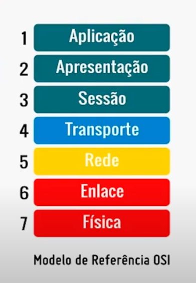
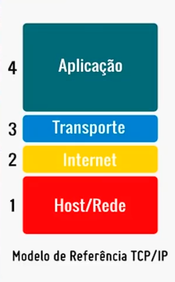
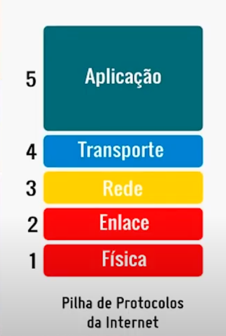

# Redes de Computadores

## Introdução

Redes de computadores são sistemas interconectados que permitem a comunicação entre dispositivos computacionais, possibilitando o compartilhamento de recursos, dados e serviços. Essas redes formam a base da internet moderna e são fundamentais para a computação distribuída.

### Conceitos Fundamentais

- **Nó**: Qualquer dispositivo conectado à rede (computador, servidor, roteador, etc.)
- **Link**: Conexão física ou lógica entre dois nós
- **Protocolo**: Conjunto de regras que governam a comunicação na rede
- **Largura de Banda**: Capacidade máxima de transmissão de dados
- **Latência**: Tempo necessário para um pacote viajar de origem ao destino
- **Throughput**: Taxa real de transferência de dados alcançada

## Tipos de Redes

### Por Abrangência Geográfica

#### LAN (Local Area Network)
- **Definição**: Rede de área local que conecta dispositivos em uma área limitada
- **Alcance**: Geralmente dentro de um edifício ou campus
- **Características**: Alta velocidade, baixa latência, controle centralizado
- **Exemplos**: Rede doméstica, rede corporativa de um escritório

#### WAN (Wide Area Network)
- **Definição**: Rede de longa distância que conecta LANs em áreas geograficamente distantes
- **Alcance**: Cidades, países ou continentes
- **Características**: Velocidades variáveis, maior latência
- **Exemplos**: Internet, redes corporativas multinacionais

#### MAN (Metropolitan Area Network)
- **Definição**: Rede metropolitana que cobre uma cidade ou região metropolitana
- **Alcance**: Entre LAN e WAN em termos de cobertura
- **Características**: Conecta múltiplas LANs em uma área urbana

### Por Topologia

#### Topologia em Estrela
- **Estrutura**: Todos os dispositivos conectam-se a um hub ou switch central
- **Vantagens**: Fácil gerenciamento, falha isolada
- **Desvantagens**: Ponto único de falha (hub central)

#### Topologia em Anel
- **Estrutura**: Dispositivos conectados em formato circular
- **Vantagens**: Sem colisões, transmissão unidirecional
- **Desvantagens**: Falha em um nó afeta toda a rede

#### Topologia em Barramento
- **Estrutura**: Todos os dispositivos conectados a um cabo principal
- **Vantagens**: Simples e econômica
- **Desvantagens**: Colisões frequentes, difícil manutenção

#### Topologia Mesh
- **Estrutura**: Múltiplas conexões entre dispositivos
- **Tipos**:
  - **Full Mesh**: Cada nó conecta-se diretamente a todos os outros
  - **Partial Mesh**: Conexões seletivas baseadas em necessidades
- **Vantagens**: Alta redundância e confiabilidade
- **Desvantagens**: Complexa e cara

#### Topologia Híbrida
- **Estrutura**: Combinação de duas ou mais topologias
- **Exemplo**: Estrela-Barramento em redes corporativas
- **Vantagens**: Flexibilidade e escalabilidade
- **Uso**: Redes empresariais complexas

### Por Arquitetura de Comunicação

#### Cliente-Servidor
```
Cliente1 ──┐
Cliente2 ──┼── Servidor Central
Cliente3 ──┘
```
- **Características**: Servidor centralizado fornece serviços
- **Vantagens**: Controle centralizado, backup simplificado
- **Desvantagens**: Ponto único de falha, gargalo no servidor

#### Peer-to-Peer (P2P)
```
Peer1 ────── Peer2
  │     ✕     │
  │   /   \   │
  │  /     \  │
Peer4 ────── Peer3
```
- **Características**: Todos os nós têm capacidades equivalentes
- **Vantagens**: Sem ponto único de falha, escalabilidade
- **Exemplos**: BitTorrent, blockchain, sistemas distribuídos

## Modelo OSI (Open Systems Interconnection)

O modelo OSI é um padrão de referência que define como os sistemas de rede devem se comunicar.

### Camadas do Modelo OSI

```
┌─────────────────────────┬──────────────────────┬─────────────────────┐
│    CAMADA               │    FUNÇÃO            │    EXEMPLOS         │
├─────────────────────────┼──────────────────────┼─────────────────────┤
│ 7. Aplicação            │ Interface usuário    │ HTTP, FTP, DNS      │
├─────────────────────────┼──────────────────────┼─────────────────────┤
│ 6. Apresentação         │ Criptografia, comp.  │ SSL/TLS, JPEG       │
├─────────────────────────┼──────────────────────┼─────────────────────┤
│ 5. Sessão               │ Gerenc. sessões      │ NetBIOS, RPC        │
├─────────────────────────┼──────────────────────┼─────────────────────┤
│ 4. Transporte           │ Entrega fim-a-fim    │ TCP, UDP            │
├─────────────────────────┼──────────────────────┼─────────────────────┤
│ 3. Rede                 │ Roteamento           │ IP, ICMP, OSPF      │
├─────────────────────────┼──────────────────────┼─────────────────────┤
│ 2. Enlace               │ Controle de acesso   │ Ethernet, PPP       │
├─────────────────────────┼──────────────────────┼─────────────────────┤
│ 1. Física               │ Transmissão bits     │ Cabo, Fibra, WiFi   │
└─────────────────────────┴──────────────────────┴─────────────────────┘
```

1. **Física**: Transmissão de bits através do meio físico (Cabo, fibra óptica, rádio)
2. **Enlace**: Controle de acesso ao meio e detecção de erros (Switches)
3. **Rede**: Roteamento de pacotes entre redes diferentes (Roteadores)
4. **Transporte**: Entrega confiável de dados fim a fim (TCP, UDP)
5. **Sessão**: Estabelecimento e gerenciamento de sessões (sockets)
6. **Apresentação**: Criptografia, compressão e formatação (JSON, XML)
7. **Aplicação**: Interface com aplicações do usuário (HTTP, FTP, DNS)



### Encapsulamento de Dados

```
┌─ Aplicação ────────────────────────────────────────────┐
│ Dados da Aplicação                                     │
├─ Transporte ───────────────────────────────────────────┤
│ Cabeçalho TCP/UDP | Dados da Aplicação                 │
├─ Rede ─────────────────────────────────────────────────┤
│ Cabeçalho IP | Cabeçalho TCP/UDP | Dados Aplicação    │
├─ Enlace ───────────────────────────────────────────────┤
│ Cab. Ethernet | Cab. IP | Cab. TCP/UDP | Dados | FCS   │
└────────────────────────────────────────────────────────┘
```

## Protocolos de Rede

### TCP/IP

#### TCP (Transmission Control Protocol)
- **Características**: Confiável, orientado à conexão
- **Uso**: Aplicações que requerem entrega garantida (HTTP, FTP, SSH)
- **Funcionalidades**: 
  - Controle de fluxo
  - Detecção e correção de erros
  - Ordenação de pacotes
  - Controle de congestionamento

**Three-Way Handshake (Estabelecimento de Conexão TCP):**
```
Cliente                    Servidor
   │                          │
   ├─── SYN (seq=x) ─────────>│
   │<── SYN-ACK (seq=y,ack=x+1)│
   ├─── ACK (ack=y+1) ───────>│
   │                          │
   │    Conexão Estabelecida   │
```

#### UDP (User Datagram Protocol)
- **Características**: Não confiável, sem conexão
- **Uso**: Aplicações em tempo real (streaming, jogos, DNS)
- **Vantagens**: Menor overhead, maior velocidade
- **Estrutura do cabeçalho**: Apenas 8 bytes vs 20+ bytes do TCP

**Comparação TCP vs UDP:**
| Aspecto | TCP | UDP |
|---------|-----|-----|
| Confiabilidade | Alta | Baixa |
| Velocidade | Menor | Maior |
| Overhead | Alto | Baixo |
| Controle de fluxo | Sim | Não |
| Ordenação | Sim | Não |
| Uso típico | HTTP, SMTP, FTP | DNS, DHCP, Gaming |

#### IP (Internet Protocol)

**Estrutura do Cabeçalho IPv4:**
```
 0                   1                   2                   3
 0 1 2 3 4 5 6 7 8 9 0 1 2 3 4 5 6 7 8 9 0 1 2 3 4 5 6 7 8 9 0 1
+-+-+-+-+-+-+-+-+-+-+-+-+-+-+-+-+-+-+-+-+-+-+-+-+-+-+-+-+-+-+-+-+
|Version|  IHL  |Type of Service|          Total Length         |
+-+-+-+-+-+-+-+-+-+-+-+-+-+-+-+-+-+-+-+-+-+-+-+-+-+-+-+-+-+-+-+-+
|         Identification        |Flags|      Fragment Offset    |
+-+-+-+-+-+-+-+-+-+-+-+-+-+-+-+-+-+-+-+-+-+-+-+-+-+-+-+-+-+-+-+-+
|  Time to Live |    Protocol   |         Header Checksum       |
+-+-+-+-+-+-+-+-+-+-+-+-+-+-+-+-+-+-+-+-+-+-+-+-+-+-+-+-+-+-+-+-+
|                       Source Address                          |
+-+-+-+-+-+-+-+-+-+-+-+-+-+-+-+-+-+-+-+-+-+-+-+-+-+-+-+-+-+-+-+-+
|                    Destination Address                        |
+-+-+-+-+-+-+-+-+-+-+-+-+-+-+-+-+-+-+-+-+-+-+-+-+-+-+-+-+-+-+-+-+
```

- **IPv4**: Endereços de 32 bits (ex: 192.168.1.1)
  - **Limitação**: ~4.3 bilhões de endereços
  - **Esgotamento**: Problema atual da internet
- **IPv6**: Endereços de 128 bits (ex: 2001:0db8:85a3::8a2e:0370:7334)
  - **Capacidade**: 340 undecilhões de endereços
  - **Recursos**: Autoconfiguração, IPSec nativo, QoS melhorado
- **Função**: Roteamento de pacotes entre redes

**Migração IPv4 para IPv6:**
- **Dual Stack**: Suporte simultâneo a IPv4 e IPv6
- **Tunneling**: Encapsulamento IPv6 em IPv4
- **NAT64**: Tradução entre IPv4 e IPv6

O Modelo TCP/IP possui duas versões:





### Protocolos de Aplicação

#### HTTP/HTTPS
- **HTTP**: Protocolo de transferência de hipertexto
- **HTTPS**: HTTP seguro com criptografia SSL/TLS
- **Porta**: 80 (HTTP), 443 (HTTPS)

#### FTP/SFTP
- **FTP**: Protocolo de transferência de arquivos
- **SFTP**: FTP seguro via SSH
- **Porta**: 21 (FTP), 22 (SFTP)

#### DNS (Domain Name System)
- **Função**: Tradução de nomes de domínio para endereços IP
- **Porta**: 53
- **Tipos de registro**: 
  - **A**: IPv4 address
  - **AAAA**: IPv6 address
  - **CNAME**: Canonical name (alias)
  - **MX**: Mail exchange
  - **NS**: Name server
  - **PTR**: Pointer (reverse DNS)
  - **TXT**: Text record
  - **SRV**: Service record

**Hierarquia DNS:**
```
                    . (root)
                   / | \
                  /  |  \
               com   org  net   edu   gov
              /  |   |    |      |     |
           google amazon     mit   nasa
           /    |      \
         www   mail    ftp
```

**Processo de Resolução DNS:**
```
1. Cliente → Resolver Local (cache)
2. Resolver → Root Server → .com Server
3. .com Server → Authoritative Server
4. Retorno com endereço IP
```

#### DHCP (Dynamic Host Configuration Protocol)
- **Função**: Atribuição automática de configurações IP
- **Porta**: 67 (servidor), 68 (cliente)
- **Processo DORA**:
  1. **Discover**: Cliente procura servidores DHCP
  2. **Offer**: Servidor oferece configuração
  3. **Request**: Cliente solicita configuração específica
  4. **Acknowledge**: Servidor confirma atribuição

#### SMTP/POP3/IMAP (Email)
- **SMTP** (Simple Mail Transfer Protocol):
  - **Porta**: 25, 587 (submission), 465 (SSL)
  - **Função**: Envio de emails
- **POP3** (Post Office Protocol v3):
  - **Porta**: 110, 995 (SSL)
  - **Características**: Download e remoção do servidor
- **IMAP** (Internet Message Access Protocol):
  - **Porta**: 143, 993 (SSL)
  - **Características**: Sincronização entre dispositivos

## Dispositivos de Rede

### Hub
- **Função**: Repetidor que conecta múltiplos dispositivos
- **Características**: Opera na camada física, domínio de colisão único
- **Status**: Obsoleto, substituído por switches

### Switch
- **Função**: Conecta dispositivos em uma LAN
- **Características**: 
  - Opera na camada de enlace (Layer 2)
  - Aprendizado de endereços MAC
  - Construção dinâmica da tabela MAC
- **Vantagens**: Cada porta é um domínio de colisão separado
- **Recursos Avançados**:
  - **VLANs**: Segmentação lógica da rede
  - **STP**: Spanning Tree Protocol para evitar loops
  - **Port Security**: Controle de acesso por porta
  - **QoS**: Quality of Service para priorização de tráfego

**Tabela MAC:**
```
MAC Address       | Port | VLAN | Age
00:11:22:33:44:55 |  1   |  10  | 120s
AA:BB:CC:DD:EE:FF |  3   |  20  | 85s
```

### Roteador
- **Função**: Conecta diferentes redes e roteia pacotes
- **Características**: 
  - Opera na camada de rede (Layer 3)
  - Mantém tabela de roteamento
  - Toma decisões baseadas em endereços IP
- **Protocolos de Roteamento**:
  - **RIP**: Distance Vector, máx. 15 hops
  - **OSPF**: Link State, convergência rápida
  - **BGP**: Path Vector, usado na internet
  - **EIGRP**: Híbrido, proprietário Cisco

**Tabela de Roteamento:**
```
Destination    | Next Hop      | Interface | Metric
192.168.1.0/24 | 0.0.0.0      | eth0      | 0
10.0.0.0/8     | 192.168.1.1  | eth0      | 1
0.0.0.0/0      | 203.0.113.1  | eth1      | 1
```

### Access Point (AP)
- **Função**: Fornece acesso wireless à rede
- **Padrões IEEE 802.11**:
  - **802.11a**: 5GHz, até 54 Mbps
  - **802.11b**: 2.4GHz, até 11 Mbps
  - **802.11g**: 2.4GHz, até 54 Mbps
  - **802.11n** (Wi-Fi 4): Dual-band, até 600 Mbps, MIMO
  - **802.11ac** (Wi-Fi 5): 5GHz, até 3.5 Gbps, MU-MIMO
  - **802.11ax** (Wi-Fi 6): Dual-band, até 9.6 Gbps, OFDMA
- **Segurança**: WEP (obsoleto), WPA, WPA2, WPA3

**Comparação Wi-Fi:**
| Padrão | Frequência | Vel. Máx | Ano | Recursos |
|--------|------------|-----------|-----|----------|
| 802.11ax | 2.4/5/6 GHz | 9.6 Gbps | 2019 | OFDMA, Target Wake Time |
| 802.11ac | 5 GHz | 3.5 Gbps | 2013 | MU-MIMO, Beamforming |
| 802.11n | 2.4/5 GHz | 600 Mbps | 2009 | MIMO, Channel Bonding |

### Firewall
- **Função**: Controla tráfego baseado em regras de segurança
- **Tipos**:
  - **Packet Filtering**: Filtra baseado em cabeçalhos
  - **Stateful Inspection**: Mantém estado das conexões
  - **Application Layer**: Inspeção profunda de pacotes
  - **Next-Gen Firewall (NGFW)**: IPS, antimalware, controle de aplicações
- **Implementação**: Hardware dedicado, software, baseado em nuvem

### Load Balancer
- **Função**: Distribui tráfego entre múltiplos servidores
- **Algoritmos**:
  - **Round Robin**: Distribuição sequencial
  - **Least Connections**: Servidor com menos conexões ativas
  - **IP Hash**: Baseado no hash do IP do cliente
  - **Weighted**: Distribuição baseada em pesos
- **Tipos**: Layer 4 (transporte), Layer 7 (aplicação)

## Endereçamento IP

### Classes de Endereços IPv4

#### Classe A
- **Faixa**: 1.0.0.0 a 126.255.255.255
- **Máscara**: 255.0.0.0 (/8)
- **Uso**: Grandes organizações

#### Classe B
- **Faixa**: 128.0.0.0 a 191.255.255.255
- **Máscara**: 255.255.0.0 (/16)
- **Uso**: Organizações médias

#### Classe C
- **Faixa**: 192.0.0.0 a 223.255.255.255
- **Máscara**: 255.255.255.0 (/24)
- **Uso**: Pequenas organizações

### Endereços Privados
- **10.0.0.0/8**: Classe A privada
- **172.16.0.0/12**: Classe B privada
- **192.168.0.0/16**: Classe C privada

### Subnetting e VLSM

#### Subnetting Básico
**Exemplo: Dividir 192.168.1.0/24 em 4 subredes:**
```
Rede Original: 192.168.1.0/24 (256 IPs)
├─ Subrede 1: 192.168.1.0/26   (64 IPs: .0-.63)
├─ Subrede 2: 192.168.1.64/26  (64 IPs: .64-.127)  
├─ Subrede 3: 192.168.1.128/26 (64 IPs: .128-.191)
└─ Subrede 4: 192.168.1.192/26 (64 IPs: .192-.255)
```

#### VLSM (Variable Length Subnet Masking)
**Exemplo: Empresa com diferentes departamentos:**
```
Departamento | Hosts Necessários | Subrede | Máscara | IPs Disponíveis
TI           | 100              | /25     | .0-.127 | 126
Vendas       | 50               | /26     | .128-.191 | 62
RH           | 25               | /27     | .192-.223 | 30
Direção      | 10               | /28     | .224-.239 | 14
```

### Endereços Especiais
- **127.0.0.1**: Loopback (localhost)
- **0.0.0.0**: Rota padrão ou endereço não especificado
- **255.255.255.255**: Broadcast limitado
- **169.254.x.x**: APIPA (Automatic Private IP Addressing)
- **224.0.0.0 - 239.255.255.255**: Multicast (Classe D)
- **240.0.0.0 - 255.255.255.255**: Reservado (Classe E)

### NAT (Network Address Translation)

**Tipos de NAT:**
- **Static NAT**: Mapeamento 1:1 fixo
- **Dynamic NAT**: Pool de endereços públicos
- **PAT/NAPT**: Port Address Translation (mais comum)

**Exemplo PAT:**
```
Rede Interna          |  NAT Router  |  Internet
192.168.1.10:1234 ────┼──────────────┼──> 203.0.113.1:5001
192.168.1.11:5678 ────┼──────────────┼──> 203.0.113.1:5002
192.168.1.12:8080 ────┼──────────────┼──> 203.0.113.1:5003
```

**Problemas do NAT:**
- Quebra da conectividade fim-a-fim
- Problemas com protocolos que carregam endereços IP
- Dificuldades com P2P e jogos online
- Limitações para servidores internos

## Segurança de Redes

### Firewall
- **Função**: Controla tráfego baseado em regras de segurança
- **Tipos**: Packet filtering, stateful, application-layer
- **Implementação**: Hardware, software ou baseado em nuvem

### VPN (Virtual Private Network)
- **Função**: Cria túnel seguro através de rede pública
- **Protocolos**:
  - **OpenVPN**: Open source, flexível, baseado em SSL/TLS
  - **IPSec**: Padrão industrial, integrado ao kernel
  - **L2TP**: Layer 2 Tunneling Protocol
  - **WireGuard**: Moderno, simples, alta performance
  - **SSTP**: Secure Socket Tunneling Protocol (Microsoft)
- **Tipos**:
  - **Site-to-Site**: Conecta duas redes corporativas
  - **Remote Access**: Usuários remotos acessam rede corporativa
  - **Client-to-Client**: Conexão direta entre clientes

**Arquitetura VPN Site-to-Site:**
```
Filial A                    Internet                    Matriz
[LAN] ──── [VPN Gateway] ════════════════ [VPN Gateway] ──── [LAN]
192.168.1.0/24           Túnel Criptografado           10.0.0.0/24
```

### IDS/IPS (Intrusion Detection/Prevention Systems)
- **IDS**: Detecta e alerta sobre atividades suspeitas
- **IPS**: Detecta e bloqueia automaticamente ameaças
- **Tipos**:
  - **NIDS/NIPS**: Network-based (monitora tráfego de rede)
  - **HIDS/HIPS**: Host-based (monitora sistema específico)
- **Métodos de Detecção**:
  - **Signature-based**: Padrões conhecidos de ataques
  - **Anomaly-based**: Desvios do comportamento normal
  - **Heuristic**: Análise comportamental avançada

### Criptografia
- **Simétrica**: 
  - Mesma chave para cifrar e decifrar
  - **Algoritmos**: AES, DES, 3DES, ChaCha20
  - **Uso**: Criptografia de dados em massa
- **Assimétrica**: 
  - Par de chaves pública/privada
  - **Algoritmos**: RSA, ECC, DSA
  - **Uso**: Troca de chaves, assinaturas digitais
- **Hash**: 
  - Função unidirecional para integridade
  - **Algoritmos**: SHA-256, SHA-3, BLAKE2
  - **Uso**: Verificação de integridade, senhas

### Zero Trust Architecture
- **Princípio**: "Nunca confie, sempre verifique"
- **Componentes**:
  - **Identity Verification**: Autenticação multifator
  - **Device Compliance**: Verificação de dispositivos
  - **Application Security**: Microsegmentação
  - **Network Segmentation**: Acesso baseado em contexto
- **Implementação**: Gradual, baseada em políticas

## Troubleshooting de Rede

### Comandos Úteis

#### ping
```bash
ping google.com
# Testa conectividade com um host
```

#### traceroute
```bash
traceroute google.com
# Mostra o caminho que os pacotes percorrem
```

#### nslookup
```bash
nslookup google.com
# Consulta DNS para resolver nomes
```

#### netstat
```bash
netstat -an
# Mostra conexões de rede ativas
```

#### iptables (Linux)
```bash
iptables -L
# Lista regras do firewall
```

### Problemas Comuns

#### Conectividade
- **Sintomas**: Não consegue acessar sites ou serviços
- **Diagnóstico**: ping, traceroute, verificar configurações de IP
- **Soluções**: Verificar cabos, configurações de rede, DNS

#### Performance
- **Sintomas**: Lentidão na rede
- **Diagnóstico**: iperf, monitoramento de largura de banda
- **Soluções**: Otimizar configurações, upgrade de hardware

#### DNS
- **Sintomas**: Sites não carregam por nome, mas funcionam por IP
- **Diagnóstico**: nslookup, dig
- **Soluções**: Configurar DNS correto, limpar cache DNS

## Boas Práticas

### Documentação
- Manter diagramas de rede atualizados
- Documentar configurações e mudanças
- Inventário de dispositivos e endereços IP

### Monitoramento
- Implementar ferramentas de monitoramento (SNMP)
- Configurar alertas para problemas de rede
- Análise regular de logs

### Segurança
- Manter firmware/software atualizados
- Implementar segmentação de rede
- Backup regular de configurações
- Políticas de acesso restritivas

### Performance
- Planejamento de capacidade
- QoS (Quality of Service) para tráfego crítico
- Otimização de roteamento

## Recursos Complementares

### 📚 Referências e Documentação

#### Documentação Oficial
- [RFC 791 - Internet Protocol](https://tools.ietf.org/html/rfc791)
- [RFC 793 - Transmission Control Protocol](https://tools.ietf.org/html/rfc793)
- [RFC 1918 - Address Allocation for Private Internets](https://tools.ietf.org/html/rfc1918)
- [IEEE 802.11 Standards](https://standards.ieee.org/standard/802_11-2020.html)

#### Livros Recomendados
- **"Computer Networks" por Andrew Tanenbaum**
- **"TCP/IP Illustrated" por W. Richard Stevens**
- **"Network Security Essentials" por William Stallings**
- **"CCNA Routing and Switching" por Todd Lammle**

### 🎥 Conteúdo Audiovisual

#### Fundamentos
- [Introdução às Redes de Computadores - Conceitos Básicos](https://www.youtube.com/watch?v=jLYSmtDGF-k)
- [Modelo OSI e TCP/IP - Explicação Completa](https://www.youtube.com/watch?v=KOrWZnGbx7s)
- [Endereçamento IP e Subnetting](https://www.youtube.com/watch?v=G-m-iP1Ql6k)

#### Configuração e Administração
- [Configuração de Roteadores Cisco](https://www.youtube.com/watch?v=M_ICLwuP8NQ)
- [Switches: VLANs e Spanning Tree](https://www.youtube.com/watch?v=7kVemWNDUIo)
- [Configuração de Firewalls](https://www.youtube.com/watch?v=BZ4yuTQmxdo)

#### Segurança
- [VPNs: Implementação e Configuração](https://www.youtube.com/watch?v=OniiDXdwZJE)
- [Segurança em Redes Sem Fio](https://www.youtube.com/watch?v=RucNhKGR224)
- [Análise de Tráfego com Wireshark](https://www.youtube.com/watch?v=LdxqHDe9Dq4)

#### Tópicos Avançados
- [IPv6: Migração e Implementação](https://www.youtube.com/watch?v=u2RlU0KPJzU)
- [Software Defined Networks (SDN)](https://www.youtube.com/watch?v=Nh2hXUuKXyQ)
- [Monitoramento de Redes com SNMP](https://www.youtube.com/watch?v=PqgDoG4gLK0)

### 🛠️ Ferramentas Práticas

#### Simuladores de Rede
- **Cisco Packet Tracer**: Simulador oficial da Cisco
- **GNS3**: Emulador de redes avançado
- **EVE-NG**: Plataforma de emulação empresarial

#### Ferramentas de Monitoramento
- **Wireshark**: Análise de protocolos
- **Nmap**: Scanner de redes e portas
- **PRTG**: Monitoramento de infraestrutura
- **Nagios**: Sistema de monitoramento open source

#### Utilitários de Linha de Comando
- **ping**: Teste de conectividade
- **traceroute**: Rastreamento de rota
- **netstat**: Estatísticas de rede
- **ss**: Informações de socket (substituto do netstat)
- **iperf3**: Teste de largura de banda

### 🎯 Certificações Relevantes

#### Cisco
- **CCNA** (Cisco Certified Network Associate)
- **CCNP** (Cisco Certified Network Professional)
- **CCIE** (Cisco Certified Internetwork Expert)

#### CompTIA
- **Network+**: Fundamentos de redes
- **Security+**: Segurança em redes

#### Outras
- **CISSP**: Certified Information Systems Security Professional
- **CEH**: Certified Ethical Hacker
- **JNCIA**: Juniper Networks Certified Associate