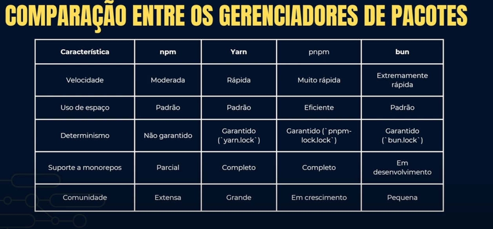

# NodeJS

O NodeJS é um *ambiente de execução JavaScript* do lado do servidor, que permite executar código JavaScript fora de um navegador. Ele é construído sobre o motor V8 do Google Chrome e é amplamente utilizado para criar aplicações web escaláveis e de alto desempenho.

## Gerenciamento de Pacotes

São ferramentas que *automatizam* o processo de instalação, atualização e remoção de bibliotecas e dependências em projetos Node.js. No contexto do Node.JS, esses pacotes geralmente contêm bibliotecas, frameworks e utilitários que facilitam o desenvolvimento de aplicações.

Scripts são comandos definidos no arquivo `package.json` que podem ser executados usando o comando `npm<qualquer-outro-gerenciador> run <script-name>`. Esses scripts são úteis para automatizar tarefas comuns, como testes, construção de projetos e execução de servidores de desenvolvimento.

```json title="package.json"
{
  "scripts": {
    "start": "node index.js",
    "test": "jest",
    "build": "tsc",
    "lint": "eslint .",
    "format": "prettier --write ."
  },
}
```

### NPM

O NPM é o **gerenciador de pacotes padrão** do Node.js, que permite instalar e gerenciar pacotes de terceiros. Ele é amplamente utilizado na comunidade Node.js e possui um **vasto repositório de pacotes** disponíveis. Permite configurar **registries de pacotes personalizados**, o que é útil para empresas que desejam manter seus próprios pacotes privados ou usar pacotes de terceiros de fontes específicas.

### Yarn

O Yarn é um gerenciador de pacotes alternativo ao NPM, **criado pelo Facebook**. Ele oferece uma série de melhorias em relação ao NPM, como:
- **Instalação mais rápida** de pacotes usando cache
- **Garantia de determinismo** na instalação de dependências 
- **Suporte a workspaces** para gerenciar múltiplos pacotes em um único repositório


### PNPM

O PNPM é um gerenciador de pacotes que se destaca por sua **eficiência no uso de espaço em disco**. Ele utiliza um **sistema de links simbólicos** para compartilhar dependências entre projetos, o que **reduz significativamente o espaço** ocupado por pacotes duplicados. Também oferece **isolamento de dependências**, garantindo que cada projeto tenha suas próprias versões de pacotes, evitando conflitos.

### BUN

O Bun é um gerenciador de pacotes e runtime JavaScript que se destaca por sua **velocidade e eficiência**. Ele é projetado para ser uma **alternativa mais rápida** ao NPM e Yarn, oferecendo **tempos de instalação significativamente menores**. O Bun também inclui um **bundler integrado**, o que facilita a criação de aplicações web otimizadas.

